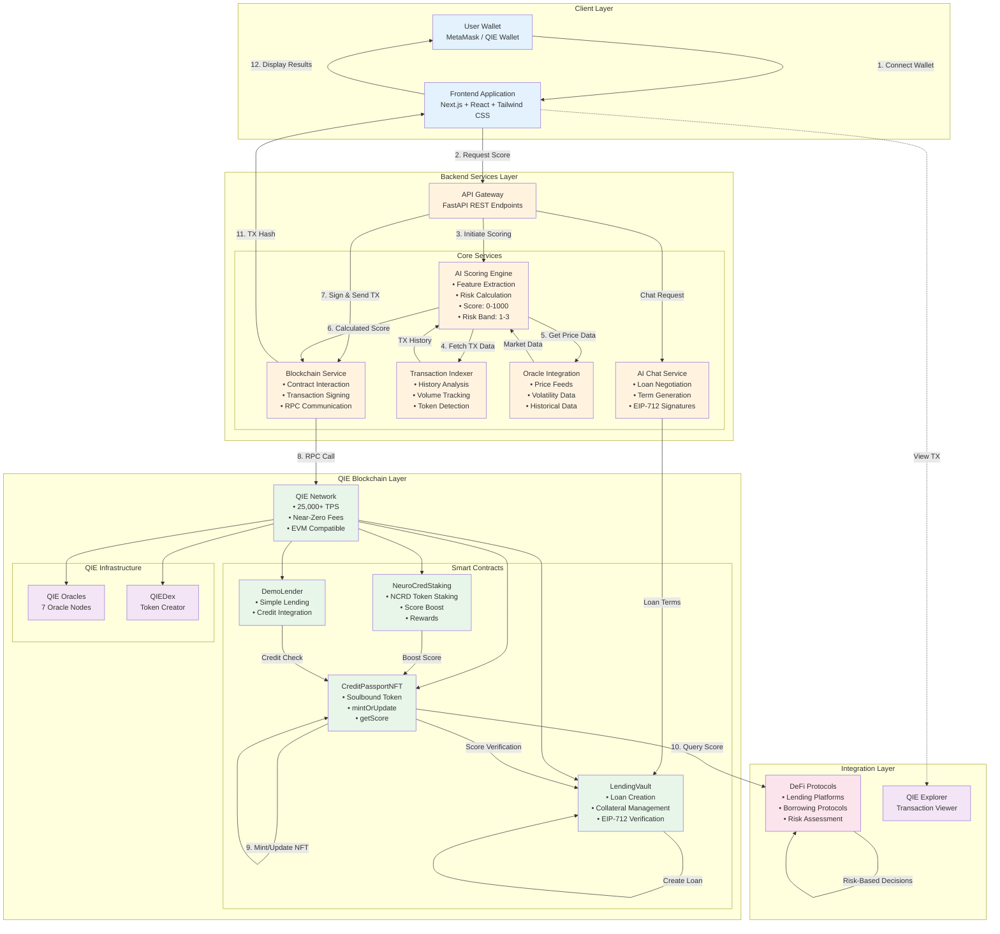
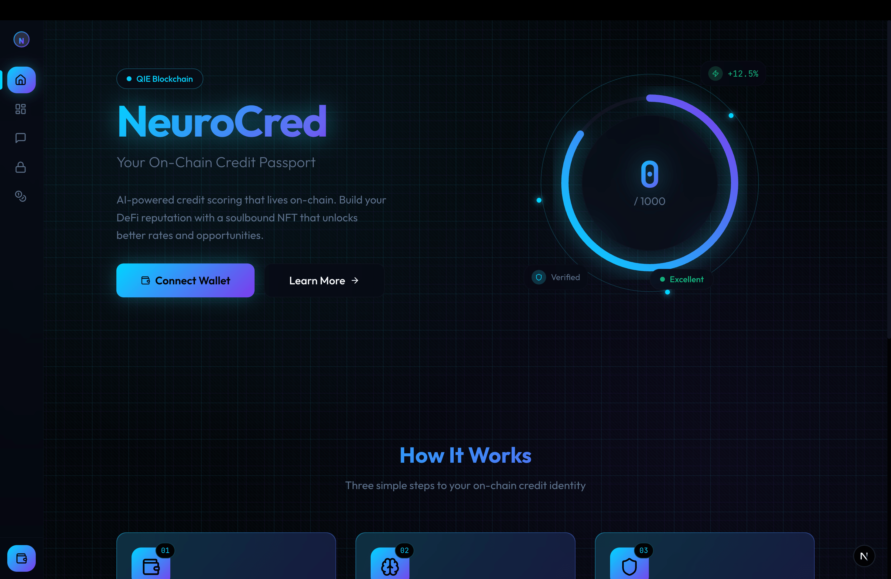
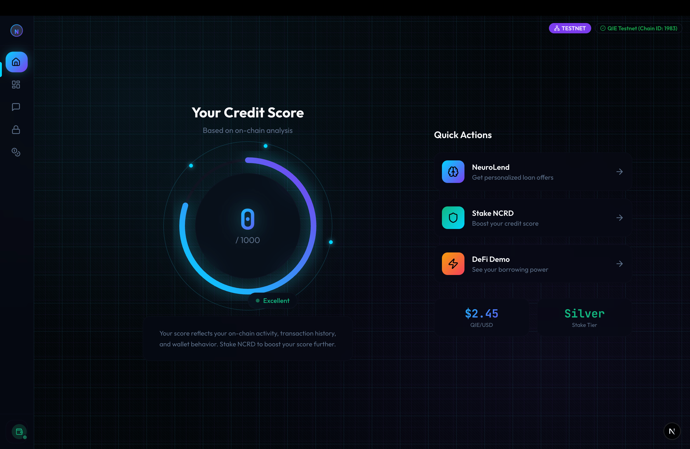
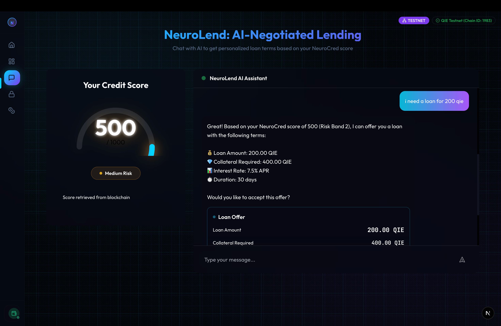
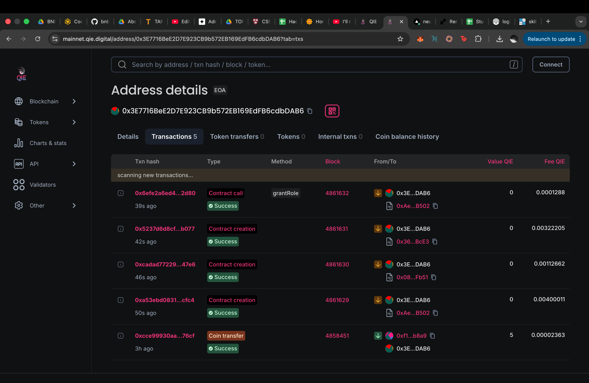

# NeuroCred — AI Credit Passport on QIE

**AI-powered on-chain credit passport (soulbound NFT) — reusable risk scores for DeFi apps on QIE.**

**Status:** ✅ **Production Ready** — Contracts deployed to QIE testnet, backend API live on Render, frontend deployed on Vercel. Full stack operational with AI scoring, on-chain passport minting, and loan negotiation.

---

## Live Demo

- **Frontend**: https://neuro-cred-git-main-diveshk007s-projects.vercel.app
- **Backend API**: https://neurocred-backend.onrender.com
- **API Docs**: https://neurocred-backend.onrender.com/docs
- **Demo Video**: https://youtu.be/HKDrJyicVn0

## Contracts

### QIE Mainnet (Production) ✅ LIVE

**Deployed on QIE Mainnet (Chain ID: 1990)**

- **CreditPassportNFT**: [`0xAe6A9CaF9739C661e593979386580d3d14abB502`](https://mainnet.qie.digital/address/0xAe6A9CaF9739C661e593979386580d3d14abB502)
- **LendingVault**: [`0x36Fda9F9F17ea5c07C0CDE540B220fC0697bBcE3`](https://mainnet.qie.digital/address/0x36Fda9F9F17ea5c07C0CDE540B220fC0697bBcE3)
- **NeuroCredStaking**: [`0x08DA91C81cebD27d181cA732615379f185FbFb51`](https://mainnet.qie.digital/address/0x08DA91C81cebD27d181cA732615379f185FbFb51)
- **NCRD Token**: `0x7427734468598674645Aa71Ef651218A9Db2be11`
- **Mainnet Explorer**: https://mainnet.qie.digital/

### QIE Testnet (Development)

- **CreditPassportNFT**: `0x34904952E5269290B783071f1eBba51c22ef6219`
- **LendingVault**: `0xd840f7E97Eb96d4901666f665A443Ea376e5BA32`
- **NeuroCredStaking**: `0x3E9943694a37d26987C1af36DE169e631b30F153`
- **Testnet Explorer**: https://testnet.qie.digital/

## QIE Hackathon Requirements

- **Wallet integration**: MetaMask / QIE Wallet (connect + sign)
- **Smart contract deployed on QIE Testnet**: CreditPassportNFT + LendingVault + Staking
- **On-chain functionality**: `mintOrUpdate` + `createLoan` + staking transactions on QIE
- **AI × Blockchain**: Chat-driven loan negotiation with on-chain settlement

---

## Overview

NeuroCred solves the problem of blind lending in DeFi by providing portable, on-chain credit identity. Wallets receive a reusable credit score stored as a soulbound NFT, enabling any protocol to make informed lending decisions with a single contract call.

### Features

- **AI-Powered Scoring** - Analyzes transaction history, portfolio composition, and on-chain behavior
- **Soulbound NFT** - Non-transferable Credit Passport stores score on-chain
- **AI Chat Negotiation** - Chat with Q-Loan AI to negotiate personalized loan terms
- **LendingVault** - On-chain lending with EIP-712 signature verification
- **Token Staking** - Stake NCRD tokens to improve credit scores
- **Universal Integration** - Simple contract interface for any dApp
- **QIE Optimized** - Built for QIE's 25,000+ TPS and near-zero fees
- **QIE Oracles** - Real-time price and volatility data integration

### Monitoring & Observability

- **Error Tracking**: Sentry integration for backend and frontend
- **Metrics**: Prometheus metrics exposed at `/metrics`
- **Logging**: Structured JSON logging with correlation IDs
- **Health Checks**: `/health` (liveness) and `/health/ready` (readiness)
- **Blockchain Monitoring**: Contract events and transaction tracking
- **Performance Monitoring**: Slow request detection and alerting
- **Analytics**: Privacy-compliant user analytics

See [docs/MONITORING.md](docs/MONITORING.md) for complete setup guide.

---

## Architecture



### Data Flow

**Core Credit Scoring Flow:**

1. **Wallet Connection** - User connects MetaMask or QIE Wallet to the frontend application
2. **Score Request** - Frontend sends wallet address to backend API via REST endpoint
3. **Scoring Initiation** - API Gateway routes request to AI Scoring Engine
4. **Transaction Analysis** - Transaction Indexer fetches and analyzes complete on-chain history
5. **Oracle Data Retrieval** - Oracle Service fetches real-time price feeds and volatility metrics from QIE Oracles
6. **Score Calculation** - AI model processes features and calculates credit score (0-1000) and risk band (1-3)
7. **Transaction Preparation** - Blockchain Service signs transaction with backend private key
8. **On-Chain Execution** - Backend submits `mintOrUpdate` transaction to QIE Network via RPC
9. **NFT Minting** - CreditPassportNFT contract creates or updates soulbound NFT with score data
10. **Protocol Integration** - DeFi protocols query user scores via `getScore()` function for risk assessment
11. **Response Delivery** - Transaction hash and score details returned to frontend
12. **User Display** - Frontend shows credit score, risk band, explanation, and transaction hash with explorer link

**AI Chat Loan Flow:**

1. User initiates chat with Q-Loan AI via frontend
2. Backend generates loan terms based on credit score and collateral
3. AI negotiates terms with user in natural language
4. Frontend generates EIP-712 typed signature for agreed terms
5. User signs loan agreement with wallet
6. Backend submits `createLoan` transaction to LendingVault
7. Smart contract verifies signature and creates loan on-chain
8. Frontend displays loan details and transaction confirmation

**Staking Boost Flow:**

1. User stakes NCRD tokens via NeuroCredStaking contract
2. Contract emits staking event with amount and duration
3. Scoring service detects staking and recalculates score
4. Higher stake amount/duration = higher score boost
5. Updated score stored in CreditPassportNFT
6. All protocols immediately see improved credit score

**Integration Benefits:**
- Lending protocols adjust LTV ratios based on risk bands
- Borrowing platforms set interest rates dynamically
- Staking provides verifiable commitment signal
- Any DeFi protocol can integrate with single contract call
- Portable credit identity across entire QIE ecosystem

---

## Quick Start

### Prerequisites

- Node.js 18+
- Python 3.10+
- QIE Testnet RPC access
- MetaMask or QIE Wallet

### Installation

```bash
# Clone repository
git clone https://github.com/DiveshK007/NeuroCred.git
cd NeuroCred

# Install contracts dependencies
cd contracts
npm install

# Install backend dependencies
cd ../backend
python -m venv venv
source venv/bin/activate  # On Windows: venv\Scripts\activate
pip install -r requirements.txt

# Install frontend dependencies
cd ../frontend
npm install
```

### Configuration

1. **Contracts** - Copy `contracts/.env.example` to `contracts/.env`:
```bash
cd contracts
cp .env.example .env
# Edit .env with your values
```

2. **Backend** - Copy `backend/.env.example` to `backend/.env`:
```bash
cd backend
cp .env.example .env
# Edit .env with your values
```

3. **Frontend** - Copy `frontend/.env.local.example` to `frontend/.env.local`:
```bash
cd frontend
cp .env.local.example .env.local
# Edit .env.local with your values
```

### Deployment

#### 1. Deploy All Contracts

```bash
cd contracts
npx hardhat run scripts/deploy_all.ts --network qieTestnet
```

This will deploy:
- `CreditPassportNFT` (always deployed)
- `NeuroCredStaking` (requires `NCRD_TOKEN_ADDRESS` in `.env`)
- `DemoLender` (requires `CreditPassportNFT` address)

**Note**: Before deploying staking contract, create NCRD token via QIEDex or deploy a minimal ERC20 token.

#### 2. Grant SCORE_UPDATER_ROLE

```bash
cd contracts
npx hardhat run scripts/grant_updater_role.ts --network qieTestnet
```

Or verify role is already granted:
```bash
npx hardhat run scripts/checkRoles.ts --network qieTestnet
```

#### 3. Configure Environment

Update `backend/.env` with contract addresses:
```env
CREDIT_PASSPORT_NFT_ADDRESS=0x...  # From deployment
STAKING_ADDRESS=0x...              # From deployment (if deployed)
DEMO_LENDER_ADDRESS=0x...          # From deployment
NCRD_TOKEN_ADDRESS=0x...           # From QIEDex or deployment
QIE_ORACLE_USD_ADDR=0x...          # QIE oracle address (optional)
```

Update `frontend/.env.local` with contract addresses:
```env
NEXT_PUBLIC_CONTRACT_ADDRESS=0x...           # CreditPassportNFT
NEXT_PUBLIC_STAKING_CONTRACT_ADDRESS=0x...   # NeuroCredStaking
NEXT_PUBLIC_DEMO_LENDER_ADDRESS=0x...        # DemoLender
```

#### 4. Start Backend

```bash
cd backend
source venv/bin/activate  # On Windows: venv\Scripts\activate
python -m uvicorn app:app --reload --port 8000
```

#### 5. Start Frontend

```bash
cd frontend
npm run dev
```

Visit `http://localhost:3000` to use the application.

---

## Project Structure

```
NeuroCred/
├── contracts/          # Smart contracts (Hardhat)
│   ├── contracts/     # Solidity contracts
│   │   ├── CreditPassportNFT.sol
│   │   ├── LendingVault.sol
│   │   ├── NeuroCredStaking.sol
│   │   └── DemoLender.sol
│   ├── scripts/       # Deployment & verification
│   └── test/          # Contract tests
├── backend/           # FastAPI backend
│   ├── services/      # Scoring, blockchain, oracle services
│   ├── utils/         # Logging, caching, error handling
│   └── models/        # Data models
├── frontend/          # Next.js frontend
│   └── app/           # Pages and components
└── docs/              # Documentation
    ├── MONITORING.md
    ├── demo-script.md
    └── qiedex-integration.md
```

---

## API Endpoints

**Base URL**: `https://neurocred-backend.onrender.com`

### Generate Score
```http
POST https://neurocred-backend.onrender.com/api/score
Content-Type: application/json

{
  "address": "0x..."
}
```

**Response:**
```json
{
  "address": "0x...",
  "score": 750,
  "riskBand": 1,
  "explanation": "Low risk: High transaction activity...",
  "transactionHash": "0x..."
}
```

**Example:**
```bash
curl -X POST https://neurocred-backend.onrender.com/api/score \
  -H "Content-Type: application/json" \
  -d '{"address": "0x742d35Cc6634C0532925a3b844Bc9e7595f0bEb"}'
```

### Get Score
```http
GET https://neurocred-backend.onrender.com/api/score/{address}
```

**Example:**
```bash
curl https://neurocred-backend.onrender.com/api/score/0x742d35Cc6634C0532925a3b844Bc9e7595f0bEb
```

### AI Chat (Q-Loan)
```http
POST https://neurocred-backend.onrender.com/api/chat
Content-Type: application/json

{
  "message": "I want to borrow 1000 USDC",
  "address": "0x..."
}
```

### Health Check
```http
GET https://neurocred-backend.onrender.com/health
GET https://neurocred-backend.onrender.com/health/ready
```

### Metrics
```http
GET https://neurocred-backend.onrender.com/metrics
```

### Interactive API Documentation
Visit https://neurocred-backend.onrender.com/docs for Swagger UI with interactive API testing.

---

## Integration

Any DeFi protocol can query NeuroCred scores:

```solidity
import "./INeuroCredScore.sol";

contract MyLendingProtocol {
    INeuroCredScore neuroCred = INeuroCredScore(0x...);
    
    function checkCredit(address borrower) external view {
        INeuroCredScore.ScoreView memory score = neuroCred.getScore(borrower);
        
        if (score.riskBand == 1) {
            // Low risk - allow higher LTV
            ltv = 80%;
        } else if (score.riskBand == 2) {
            // Medium risk
            ltv = 60%;
        } else {
            // High risk
            ltv = 40%;
        }
    }
}
```

---

## Testing

```bash
# Test contracts
cd contracts
npm test

# Verify deployment
npx hardhat run scripts/verify-deployment.ts --network qieTestnet

# Verify SCORE_UPDATER_ROLE
npx hardhat run scripts/checkRoles.ts --network qieTestnet
```

### Role Verification

To verify that the backend has `SCORE_UPDATER_ROLE`:

```bash
cd contracts
npx hardhat run scripts/checkRoles.ts --network qieTestnet
```

This will output:
- `SCORE_UPDATER_ROLE: GRANTED` if role is set correctly
- `SCORE_UPDATER_ROLE: NOT GRANTED` if role needs to be granted

---

## NCRD Token Creation (QIEDex)

To create the NCRD token via QIEDex:

1. Visit QIEDex token creator (check QIE documentation for URL)
2. Create ERC-20 token with:
   - Name: "NeuroCred Token"
   - Symbol: "NCRD"
   - Decimals: 18
   - Initial supply: Your choice
3. Copy the deployed token address
4. Add to `.env` files as `NCRD_TOKEN_ADDRESS`
5. Deploy `NeuroCredStaking` contract pointing to this token

**Alternative**: For local testing, you can deploy a minimal ERC-20 contract. See `contracts/test/NeuroCredStaking.test.ts` for example.

---

## Tech Stack

- **Smart Contracts**: Solidity, Hardhat, OpenZeppelin
- **Backend**: FastAPI, Python, Web3.py
- **Frontend**: Next.js, React, Ethers.js, Tailwind CSS
- **Blockchain**: QIE Testnet (EVM-compatible)
- **Oracles**: QIE Oracles (7 oracles)
- **Monitoring**: Sentry, Prometheus
- **AI**: OpenAI GPT-4 for chat negotiation

---

## Screenshots


*Landing page with wallet connection*


*Score generation showing score, risk band, and transaction hash*


*Q-Loan AI chat interface for loan negotiation*


*NCRD token staking interface*


*QIE Explorer showing on-chain transaction*

---

## Links

- **GitHub**: https://github.com/DiveshK007/NeuroCred
- **Demo Video**: https://youtu.be/HKDrJyicVn0
- **Live Frontend**: https://neuro-cred-git-main-diveshk007s-projects.vercel.app
- **Live Backend API**: https://neurocred-backend.onrender.com
- **API Documentation**: https://neurocred-backend.onrender.com/docs
- **Contract Address**: `0x34904952E5269290B783071f1eBba51c22ef6219`
- **Explorer**: https://testnet.qie.digital/address/0x34904952E5269290B783071f1eBba51c22ef6219

---

## Security

- All `.env` files are gitignored
- No private keys committed to repository
- Keys have been rotated and verified clean history
- See `.gitignore` for complete list of ignored files
- EIP-712 signature verification for loan agreements
- Role-based access control for contract updates

---

## License

MIT License - see LICENSE file for details

---

Built for QIE Hackathon 2025
