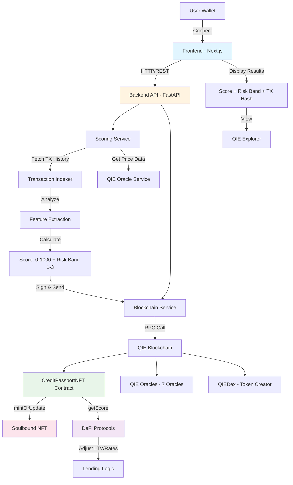

# NeuroCred — AI Credit Passport on QIE

**AI-powered on-chain credit passport (soulbound NFT) — reusable risk scores for DeFi apps on QIE.**

---

## Live Demo

- **Frontend**: `https://your-deployment.vercel.app` *(Update after deployment)*
- **Backend API**: `https://your-deployment.onrender.com` *(Update after deployment)*
- **Demo Video**: `https://youtu.be/your-video-id` *(Add your video link)*

## Contracts

- **CreditPassportNFT (Testnet)**: `0xYourContractAddress` *(Add after deployment)*
- **Example mint tx**: `https://testnet.qie.digital/tx/0xYourTxHash` *(Add after first mint)*

## QIE Requirements

- **Wallet integration**: MetaMask / QIE Wallet (connect + sign)
- **Smart contract deployed on QIE Testnet**: address above
- **On-chain functionality**: `mintOrUpdate` called by backend (tx link above)

---

## Overview

NeuroCred solves the problem of blind lending in DeFi by providing portable, on-chain credit identity. Wallets receive a reusable credit score stored as a soulbound NFT, enabling any protocol to make informed lending decisions with a single contract call.

### Features

- **AI-Powered Scoring** - Analyzes transaction history, portfolio composition, and on-chain behavior
- **Soulbound NFT** - Non-transferable Credit Passport stores score on-chain
- **Universal Integration** - Simple contract interface for any dApp
- **QIE Optimized** - Built for QIE's 25,000+ TPS and near-zero fees
- **QIE Oracles** - Real-time price and volatility data integration

---

## Architecture



### Data Flow

1. **User Connection** - User connects wallet via MetaMask/QIE Wallet
2. **Score Request** - Frontend sends address to backend API
3. **Analysis Phase** - Backend analyzes transaction history and fetches oracle data
4. **Score Calculation** - AI model calculates credit score (0-1000) and risk band (1-3)
5. **On-Chain Storage** - Backend signs and sends `mintOrUpdate` transaction
6. **NFT Minting** - Soulbound NFT created/updated with score data
7. **Display Results** - Frontend shows score, risk band, and transaction hash
8. **Protocol Integration** - DeFi protocols query score via `getScore()` function

---

## Quick Start

### Prerequisites

- Node.js 18+
- Python 3.10+
- QIE Testnet RPC access
- MetaMask or QIE Wallet

### Installation

```bash
# Clone repository
git clone https://github.com/DiveshK007/NeuroCred.git
cd NeuroCred

# Install contracts dependencies
cd contracts
npm install

# Install backend dependencies
cd ../backend
python -m venv venv
source venv/bin/activate  # On Windows: venv\Scripts\activate
pip install -r requirements.txt

# Install frontend dependencies
cd ../frontend
npm install
```

### Configuration

1. **Contracts** - Copy `contracts/.env.example` to `contracts/.env`:
```bash
cd contracts
cp .env.example .env
# Edit .env with your values
```

2. **Backend** - Copy `backend/.env.example` to `backend/.env`:
```bash
cd backend
cp .env.example .env
# Edit .env with your values
```

3. **Frontend** - Copy `frontend/.env.local.example` to `frontend/.env.local`:
```bash
cd frontend
cp .env.local.example .env.local
# Edit .env.local with your values
```

### Deployment

```bash
# 1. Deploy contracts to QIE Testnet
cd contracts
npx hardhat run scripts/deploy.ts --network qie_testnet

# 2. Verify SCORE_UPDATER_ROLE is set
npx hardhat run scripts/checkRoles.ts --network qie_testnet

# 3. Start backend
cd ../backend
source venv/bin/activate  # On Windows: venv\Scripts\activate
python -m uvicorn app:app --reload --port 8000

# 4. Start frontend (in new terminal)
cd frontend
npm run dev
```

Visit `http://localhost:3000` to use the application.

---

## Project Structure

```
NeuroCred/
├── contracts/          # Smart contracts (Hardhat)
│   ├── contracts/     # Solidity contracts
│   ├── scripts/       # Deployment & verification
│   └── test/          # Contract tests
├── backend/           # FastAPI backend
│   ├── services/      # Scoring, blockchain, oracle services
│   ├── utils/         # Logging, caching, error handling
│   └── models/        # Data models
├── frontend/          # Next.js frontend
│   └── app/           # Pages and components
└── docs/              # Documentation
```

---

## API Endpoints

### Generate Score
```http
POST /api/score
Content-Type: application/json

{
  "address": "0x..."
}
```

**Response:**
```json
{
  "address": "0x...",
  "score": 750,
  "riskBand": 1,
  "explanation": "Low risk: High transaction activity...",
  "transactionHash": "0x..."
}
```

### Get Score
```http
GET /api/score/{address}
```

### Health Check
```http
GET /health
```

---

## Integration

Any DeFi protocol can query NeuroCred scores:

```solidity
import "./INeuroCredScore.sol";

contract MyLendingProtocol {
    INeuroCredScore neuroCred = INeuroCredScore(0x...);
    
    function checkCredit(address borrower) external view {
        INeuroCredScore.ScoreView memory score = neuroCred.getScore(borrower);
        
        if (score.riskBand == 1) {
            // Low risk - allow higher LTV
            ltv = 80%;
        } else if (score.riskBand == 2) {
            // Medium risk
            ltv = 60%;
        } else {
            // High risk
            ltv = 40%;
        }
    }
}
```

---

## Testing

```bash
# Test contracts
cd contracts
npm test

# Verify deployment
npx hardhat run scripts/verify-deployment.ts --network qie_testnet

# Verify SCORE_UPDATER_ROLE
npx hardhat run scripts/checkRoles.ts --network qie_testnet
```

---

## Tech Stack

- **Smart Contracts**: Solidity, Hardhat, OpenZeppelin
- **Backend**: FastAPI, Python, Web3.py
- **Frontend**: Next.js, React, Ethers.js, Tailwind CSS
- **Blockchain**: QIE Testnet (EVM-compatible)
- **Oracles**: QIE Oracles (7 oracles)

---

## Screenshots


*Landing page with wallet connection*


*Score generation showing score, risk band, and transaction hash*


*QIE Explorer showing on-chain transaction*

---

## Links

- **GitHub**: https://github.com/DiveshK007/NeuroCred
- **Demo Video**: `https://youtu.be/your-video-id` *(Add your video link)*
- **Contract Address**: `0xYourContractAddress` *(Add after deployment)*
- **Explorer**: `https://testnet.qie.digital/address/0xYourContractAddress` *(Add after deployment)*
- **Example Transaction**: `https://testnet.qie.digital/tx/0xYourTxHash` *(Add after first mint)*

---

## Team

**Divesh Kumar**
- GitHub: [@DiveshK007](https://github.com/DiveshK007)
- Email: diveshkumar.s007@gmail.com

---

## Security

- All `.env` files are gitignored
- No private keys committed to repository
- Keys have been rotated and verified clean history
- See `.gitignore` for complete list of ignored files

---

## License

MIT License - see LICENSE file for details

---

Built for QIE Hackathon 2025
