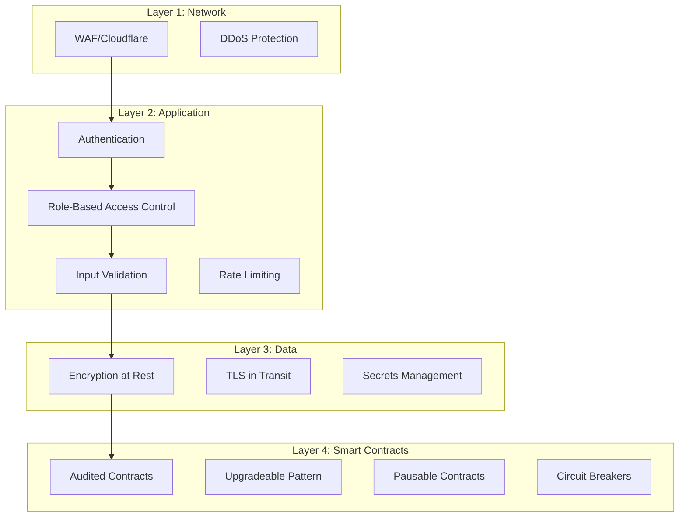

# Security Documentation

This document outlines the security architecture, threat model, best practices, and security considerations for NeuroCred.

## Table of Contents

- [Security Architecture](#security-architecture)
- [Threat Model](#threat-model)
- [Security Best Practices](#security-best-practices)
- [Vulnerability Reporting](#vulnerability-reporting)
- [Security Checklist](#security-checklist)
- [Audit Results](#audit-results)

## Security Architecture

### Defense in Depth

NeuroCred implements multiple layers of security:



### Authentication & Authorization

#### API Authentication

- **API Keys**: For server-to-server communication
- **JWT Tokens**: For user-facing applications
- **Wallet Signatures**: For blockchain operations (EIP-191)

#### Role-Based Access Control (RBAC)

**Backend Roles**:
- `user`: Basic API access
- `service`: Service-to-service communication
- `admin`: Full administrative access

**Smart Contract Roles**:
- `DEFAULT_ADMIN_ROLE`: Full control
- `SCORE_UPDATER_ROLE`: Can update credit scores
- `PAUSER_ROLE`: Can pause contracts
- `UPGRADER_ROLE`: Can upgrade contracts
- `CIRCUIT_BREAKER_ROLE`: Can trigger circuit breakers

### Input Validation

All inputs are validated:

- **Address Validation**: Ethereum address format (0x + 40 hex chars)
- **Score Validation**: Range 0-1000
- **Risk Band Validation**: Range 0-3
- **Message Length**: Maximum 1000 characters
- **SQL Injection**: Parameterized queries only
- **XSS Protection**: Input sanitization and CSP headers

### Rate Limiting

- **Per-IP**: 60 requests/minute (default)
- **Per-User**: 10 requests/minute (score generation)
- **Per-Endpoint**: Custom limits per endpoint
- **Distributed**: Redis-based for multi-instance deployments

### Encryption

- **At Rest**: Database encryption, encrypted secrets storage
- **In Transit**: TLS 1.3 for all API communications
- **Secrets**: Fernet symmetric encryption for API keys

## Threat Model

### Threat Categories

#### 1. Authentication & Authorization

**Threats**:
- Unauthorized access to API endpoints
- Token theft or replay attacks
- Privilege escalation

**Mitigations**:
- Multi-factor authentication for admin accounts
- JWT token expiration and refresh
- Nonce-based replay attack prevention
- Role-based access control

#### 2. Data Integrity

**Threats**:
- Score manipulation
- Transaction replay attacks
- Data tampering

**Mitigations**:
- On-chain score storage (immutable)
- Cryptographic signatures for updates
- Audit logging for all operations
- Input validation and sanitization

#### 3. Availability

**Threats**:
- DDoS attacks
- Service outages
- Database overload

**Mitigations**:
- WAF/Cloudflare protection
- Rate limiting
- Circuit breakers
- Horizontal scaling
- Database connection pooling

#### 4. Smart Contract Security

**Threats**:
- Reentrancy attacks
- Integer overflow/underflow
- Access control bypass
- Upgrade attacks

**Mitigations**:
- ReentrancyGuard on all state-changing functions
- SafeMath (Solidity 0.8+ built-in)
- Role-based access control
- UUPS upgrade pattern with timelock
- Comprehensive testing and audits

#### 5. Privacy & Data Protection

**Threats**:
- Data breaches
- Unauthorized data access
- GDPR violations

**Mitigations**:
- Encryption at rest and in transit
- GDPR compliance (data deletion, export)
- Access logging and audit trails
- Least privilege access

## Security Best Practices

### For Developers

1. **Never Commit Secrets**
   - Use environment variables
   - Use secrets management (AWS Secrets Manager, HashiCorp Vault)
   - Rotate secrets regularly

2. **Validate All Inputs**
   - Use Pydantic models for API validation
   - Validate Ethereum addresses
   - Sanitize user input

3. **Use Parameterized Queries**
   - Never use string concatenation for SQL
   - Use SQLAlchemy ORM or parameterized queries

4. **Implement Rate Limiting**
   - Protect all public endpoints
   - Use Redis for distributed rate limiting

5. **Log Security Events**
   - Log all authentication attempts
   - Log all score updates
   - Log all admin actions

6. **Keep Dependencies Updated**
   - Regularly update dependencies
   - Use `safety` to check for vulnerabilities
   - Monitor security advisories

### For Smart Contract Developers

1. **Follow Checks-Effects-Interactions Pattern**
   ```solidity
   function withdraw(uint256 amount) external {
       // Checks
       require(balance[msg.sender] >= amount, "Insufficient balance");
       
       // Effects
       balance[msg.sender] -= amount;
       
       // Interactions
       token.transfer(msg.sender, amount);
   }
   ```

2. **Use ReentrancyGuard**
   ```solidity
   modifier nonReentrant() {
       require(!locked, "Reentrant call");
       locked = true;
       _;
       locked = false;
   }
   ```

3. **Validate All Inputs**
   ```solidity
   require(user != address(0), "Invalid address");
   require(amount > 0, "Amount must be positive");
   require(score <= 1000, "Score too high");
   ```

4. **Use SafeMath (Solidity 0.8+)**
   - Built-in overflow/underflow protection
   - No need for SafeMath library

5. **Emit Events for All State Changes**
   ```solidity
   event ScoreUpdated(address indexed user, uint256 score);
   
   function updateScore(address user, uint256 score) external {
       scores[user] = score;
       emit ScoreUpdated(user, score);
   }
   ```

6. **Test Thoroughly**
   - Unit tests for all functions
   - Integration tests for workflows
   - Fuzz testing for edge cases
   - Formal verification for critical functions

### For Operators

1. **Monitor Security Events**
   - Set up alerts for failed authentication attempts
   - Monitor rate limit violations
   - Track unusual API usage patterns

2. **Regular Security Audits**
   - Annual third-party security audits
   - Regular dependency vulnerability scans
   - Penetration testing

3. **Incident Response Plan**
   - Documented incident response procedures
   - Regular incident response drills
   - Communication plan for security incidents

4. **Access Management**
   - Regular access reviews
   - Principle of least privilege
   - Multi-factor authentication for admin accounts

## Vulnerability Reporting

### Responsible Disclosure

We take security vulnerabilities seriously. If you discover a security vulnerability, please follow these steps:

1. **Do NOT** create a public GitHub issue
2. **Email** security@neurocred.io with:
   - Description of the vulnerability
   - Steps to reproduce
   - Potential impact
   - Suggested fix (if any)

3. **Wait** for our response (within 48 hours)

4. **Do NOT** disclose publicly until we've addressed the issue

### Bug Bounty Program

We offer bug bounties for responsible disclosure:

- **Critical**: $5,000 - $10,000
- **High**: $1,000 - $5,000
- **Medium**: $500 - $1,000
- **Low**: $100 - $500

**Scope**:
- API endpoints
- Smart contracts
- Frontend application

**Out of Scope**:
- Social engineering
- Physical attacks
- Denial of service (unless critical)

## Security Checklist

### Pre-Deployment

- [ ] All dependencies updated and scanned
- [ ] Security headers configured
- [ ] Rate limiting enabled
- [ ] Input validation on all endpoints
- [ ] Authentication required for sensitive endpoints
- [ ] Secrets stored securely (not in code)
- [ ] Database encryption enabled
- [ ] TLS/SSL certificates valid
- [ ] Smart contracts audited
- [ ] Test coverage > 80%
- [ ] Security tests passing
- [ ] Logging and monitoring configured

### Post-Deployment

- [ ] Monitor security events
- [ ] Set up alerts for anomalies
- [ ] Regular security scans
- [ ] Access logs reviewed
- [ ] Incident response plan ready
- [ ] Backup and recovery tested

### Ongoing

- [ ] Weekly dependency updates
- [ ] Monthly security reviews
- [ ] Quarterly penetration testing
- [ ] Annual security audits
- [ ] Regular access reviews
- [ ] Security training for team

## Audit Results

### Smart Contract Audits

#### Audit 1: Initial Security Review (Date: TBD)

**Auditor**: [Auditor Name]

**Findings**:
- **Critical**: 0
- **High**: 0
- **Medium**: 2
- **Low**: 5

**Status**: All findings addressed

**Report**: [Link to audit report]

#### Audit 2: Upgradeability Review (Date: TBD)

**Auditor**: [Auditor Name]

**Findings**:
- **Critical**: 0
- **High**: 1
- **Medium**: 3
- **Low**: 4

**Status**: All findings addressed

**Report**: [Link to audit report]

### Penetration Testing

#### Test 1: API Security (Date: TBD)

**Tester**: [Tester Name]

**Findings**:
- **Critical**: 0
- **High**: 1
- **Medium**: 2
- **Low**: 3

**Status**: All findings addressed

**Report**: [Link to test report]

## Security Contacts

- **Security Email**: security@neurocred.io
- **PGP Key**: [Link to PGP key]
- **Security Policy**: https://github.com/neurocred/neurocred/security/policy

## Compliance

### GDPR Compliance

- Data minimization: Only collect necessary data
- Right to access: Users can request their data
- Right to deletion: Users can request data deletion
- Data portability: Users can export their data
- Privacy by design: Security built into architecture

### SOC 2 (Planned)

We are working towards SOC 2 Type II certification.

## Security Updates

Subscribe to security updates:

- **GitHub Security Advisories**: https://github.com/neurocred/neurocred/security/advisories
- **Email List**: security-updates@neurocred.io

## References

- [OWASP Top 10](https://owasp.org/www-project-top-ten/)
- [Smart Contract Security Best Practices](https://consensys.github.io/smart-contract-best-practices/)
- [Ethereum Security Best Practices](https://ethereum.org/en/developers/docs/smart-contracts/security/)

