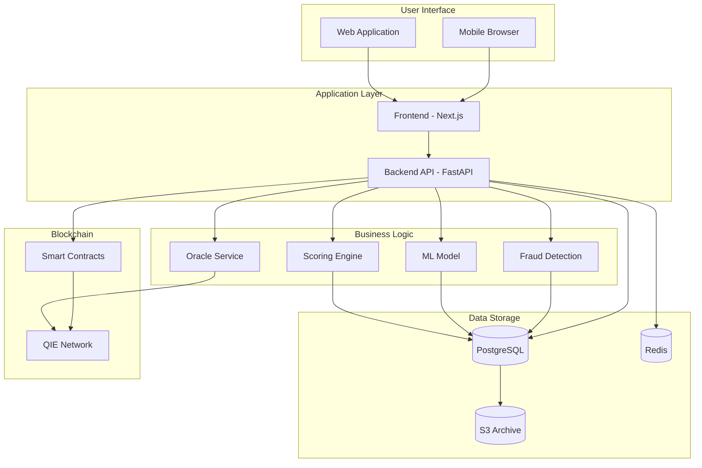
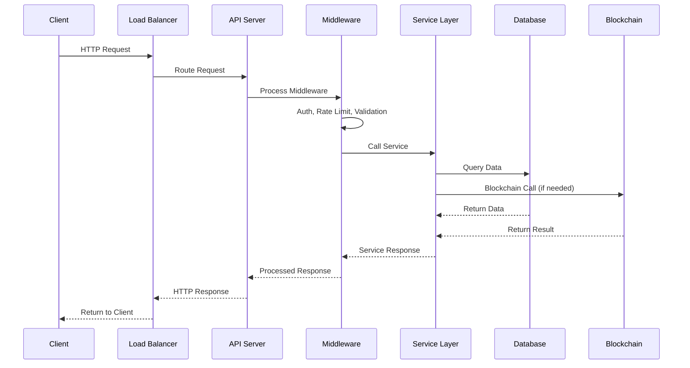
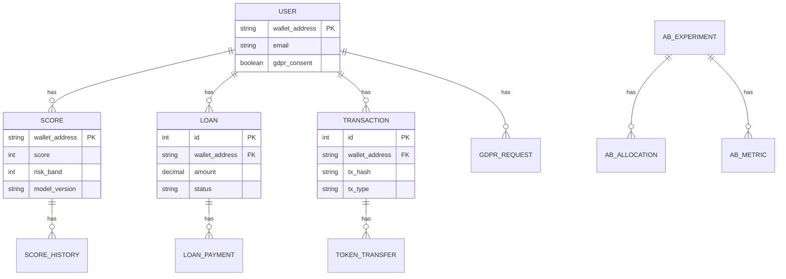

# Architecture Diagrams

This document contains detailed architecture diagrams for the NeuroCred system.

## System Overview



## Request Flow



## Database Schema



## Service Interactions

```mermaid
graph LR
    subgraph "API Endpoints"
        E1[/api/score]
        E2[/api/staking]
        E3[/api/loan]
        E4[/api/oracle]
    end
    
    subgraph "Services"
        SS[ScoringService]
        ML[MLScoringService]
        BS[BlockchainService]
        OS[OracleService]
        FS[FeatureEngineering]
    end
    
    E1 --> SS
    E1 --> ML
    E2 --> BS
    E3 --> BS
    E4 --> OS
    SS --> FS
    ML --> FS
    BS --> BC[Blockchain]
    OS --> BC
```

