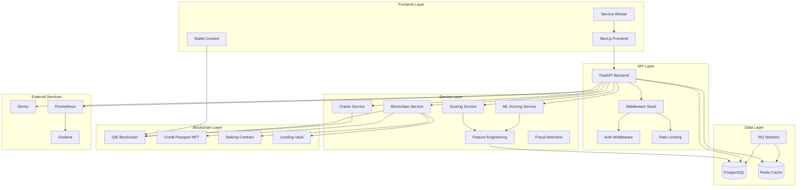
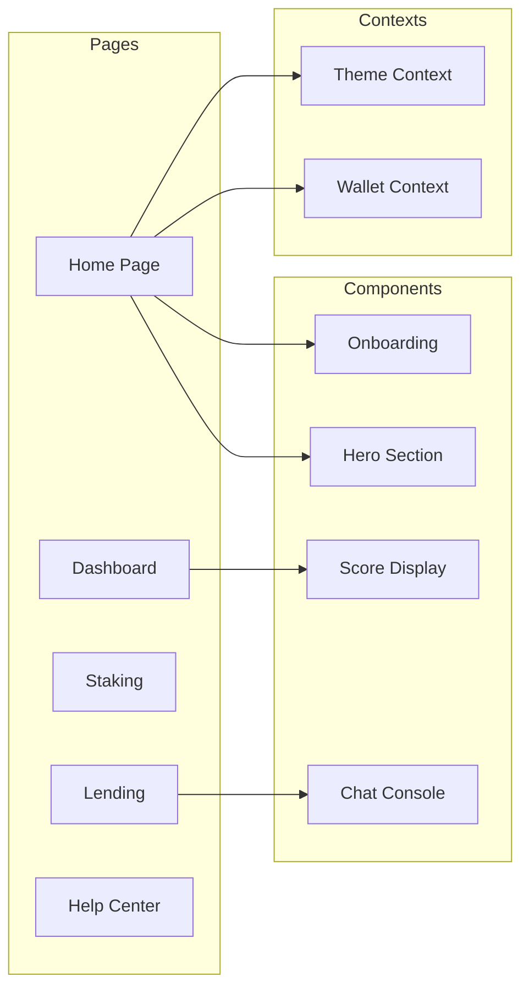
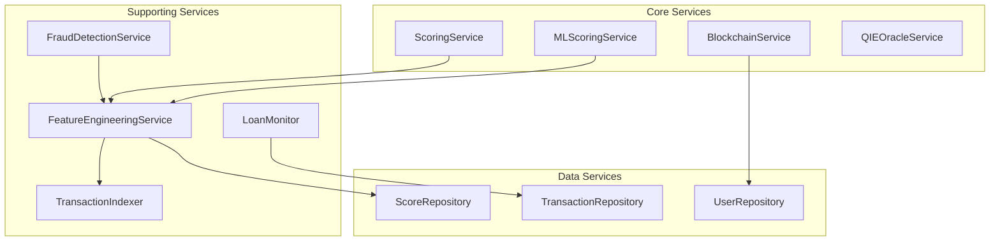
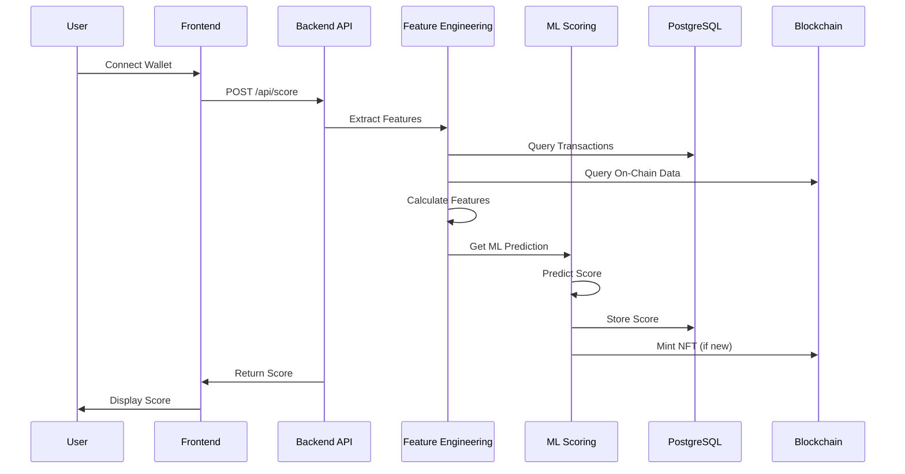
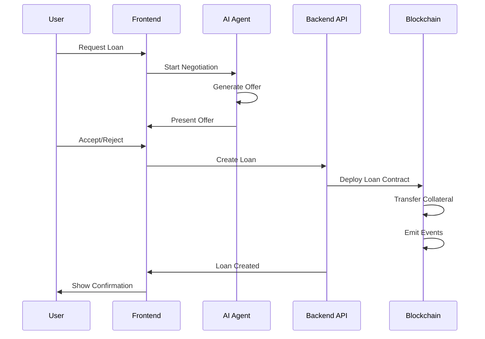
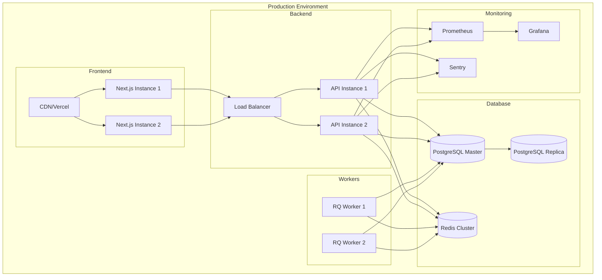

# NeuroCred Architecture

## Overview

NeuroCred is an AI-powered credit scoring system built on the QIE blockchain. It provides on-chain credit scores, staking mechanisms, and DeFi lending capabilities.

## System Architecture

## Component Architecture

### Frontend Components

### Backend Services

## Data Flow

### Credit Score Generation Flow

### Loan Creation Flow

## Deployment Architecture

## Technology Stack

### Frontend
- **Framework**: Next.js 16 (React 19)
- **Styling**: Tailwind CSS
- **UI Components**: Radix UI, Shadcn-ui
- **State Management**: React Context, TanStack Query
- **Blockchain**: Ethers.js
- **Animations**: Framer Motion
- **Monitoring**: Sentry

### Backend
- **Framework**: FastAPI (Python)
- **Database**: PostgreSQL (asyncpg)
- **Cache**: Redis
- **Queue**: RQ (Redis Queue)
- **ML**: XGBoost, scikit-learn
- **Blockchain**: Web3.py
- **Monitoring**: Sentry, Prometheus

### Smart Contracts
- **Language**: Solidity
- **Framework**: Hardhat
- **Patterns**: UUPS Upgradeable, Pausable, Access Control
- **Standards**: ERC-721 (NFT), ERC-20

### Infrastructure
- **Containerization**: Docker
- **Orchestration**: Kubernetes
- **CI/CD**: GitHub Actions
- **Monitoring**: Prometheus, Grafana, Sentry
- **Deployment**: Vercel/Render

## Security Architecture

```mermaid
graph TB
    subgraph "Security Layers"
        WAF[WAF/Cloudflare]
        AUTH[Authentication]
        RBAC[Role-Based Access]
        VAL[Input Validation]
        ENC[Encryption]
    end
    
    subgraph "Protection Mechanisms"
        RL[Rate Limiting]
        CSRF[CSRF Protection]
        XSS[XSS Protection]
        SQL[SQL Injection Protection]
        REPLAY[Replay Attack Prevention]
    end
    
    WAF --> AUTH
    AUTH --> RBAC
    RBAC --> VAL
    VAL --> ENC
    RL --> CSRF
    CSRF --> XSS
    XSS --> SQL
    SQL --> REPLAY
```

## Scalability Considerations

1. **Horizontal Scaling**: API instances can be scaled independently
2. **Database Replication**: Read replicas for analytics queries
3. **Caching Strategy**: Multi-layer caching (Redis, CDN)
4. **Async Processing**: Background workers for heavy operations
5. **Connection Pooling**: Database and RPC connection pooling
6. **Load Balancing**: Distributed load across instances

## Performance Optimizations

1. **CDN**: Static assets served via CDN
2. **Database Indexing**: Optimized indexes for common queries
3. **Query Optimization**: Batch operations, connection pooling
4. **Caching**: Aggressive caching of scores and API responses
5. **Code Splitting**: Frontend code splitting for faster loads
6. **Service Worker**: Offline support and asset caching

